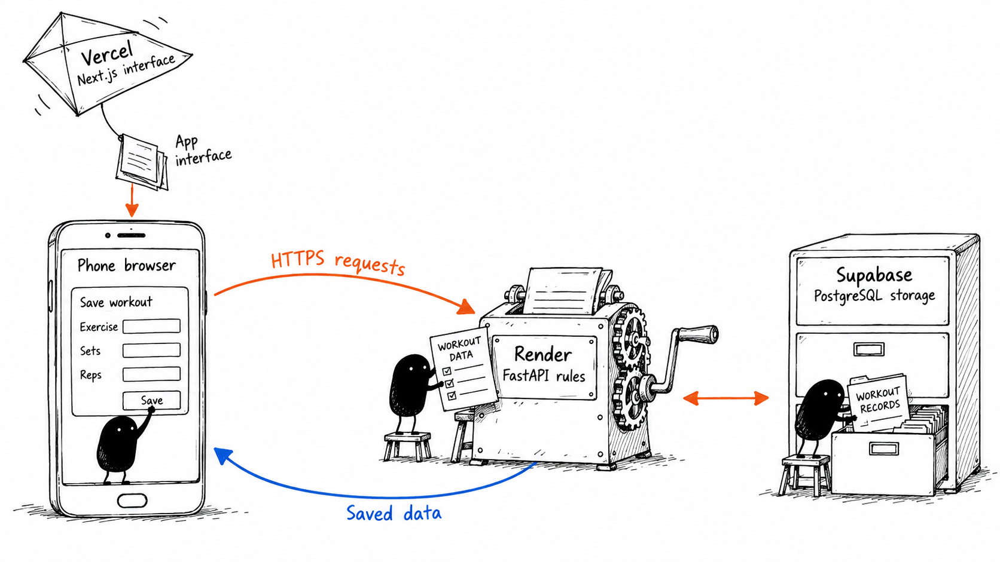
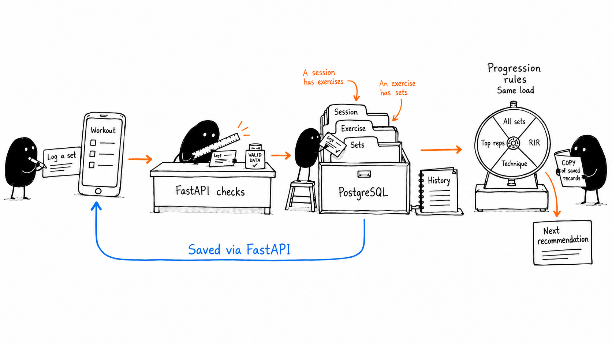

# Adaptive Athlete: how the parts interact

Created 27 September 2026 from the local implementation. Illustrations use the Ian Xiaohei skill with the built-in image generator and English labels. These are teaching metaphors, not screenshots. No credentials or personal workout records were included in the image prompts.

## 1. Where the app runs

Vercel delivers the Next.js/React interface to your phone. That interface runs in the browser and calls the FastAPI backend on Render directly over HTTPS. FastAPI reads and writes PostgreSQL hosted by Supabase, then returns JSON data to the browser. Vercel does not proxy these API requests or connect to the database.

| Part | Responsibility | Code to explore |
| --- | --- | --- |
| Next.js / React / TypeScript | Screens, inputs and displaying server responses | `frontend/src/` |
| API client | Builds requests to Render; handles errors and waking state | `frontend/src/lib/workout-api.ts` |
| Save queue | Keeps pending browser drafts, serialises saves, handles retries and conflicts | `frontend/src/lib/session-save-queue.ts` |
| FastAPI routes | Accepts requests and returns validated response shapes | `backend/app/api/routes/workouts.py` |
| Workout service | Starts, saves, finishes and corrects sessions | `backend/app/workouts.py` |
| Programme and progression | Defines prescriptions and calculates next recommendations | `backend/app/programme.py`, `backend/app/progression.py` |
| Database connection | Connects the backend privately to PostgreSQL | `backend/app/database.py` |
| SQL migrations | Defines tables, relationships and constraints | `backend/migrations/` |

`NEXT_PUBLIC_API_BASE_URL` is the public backend address embedded in the frontend build. `DATABASE_URL` is backend-only and must never be put in browser code. `CORS_ORIGINS` tells browsers which frontend origins may use the API; it is not a login system.

GitHub stores code and deployment history. Vercel and Render build their respective parts from that code. GitHub and your laptop are not intermediaries when you save a workout on your phone.

## 2. From a set to the next recommendation

1. **Open Today:** `GET /api/today` loads recommendations, completed-session calendar data and any active session.
2. **Start:** `POST /api/sessions` creates one session, copies its current prescription into a snapshot, and creates linked exercise and set records.
3. **Enter values:** the interface retains pending edits locally. The save queue sends session edits to `PUT /api/sessions/{id}`. Although you interact with individual sets, the current save request carries the session's exercise logs.
4. **Save:** FastAPI validates the values and expected revision, updates the existing rows in a database transaction, and returns the saved state. A mutation ID lets a repeated request be recognised. Pending drafts are distinct from confirmed database saves.
5. **Finish:** `POST /api/sessions/{id}/finish` records the finish time and marks the session completed, partial or cancelled, depending on its completed sets. Skipped or unfinished sets retain missing actual values rather than becoming invented zero-rep sets.
6. **Read again:** history and session-detail requests retrieve PostgreSQL records. Refreshing the browser does not erase confirmed saves. The calendar derives from finished sessions using their London start date.
7. **Recommend:** backend rules read relevant prior performance. For ordinary loaded exercises, increasing requires all prescribed sets at a consistent load, reaching the top of the rep range, meeting minimum RIR and confirming technique. Equipment increments can be automatic or require a manual choice. Timed and quality exercises follow their own handling.

The rule wheel in the picture is a metaphor for Python conditionals, not chance or an AI model. Progression runs inside the FastAPI backend; it is not another hosted service. The history book is a view of database records, not another copy of the database. The blue return path travels through FastAPI, never directly from PostgreSQL to the phone.

Prescription and actual performance remain separate: what the app asked you to do is stored in the session snapshot, while what you did is stored in linked sets. Later recommendations do not rewrite that snapshot.

Rotation follows the latest completed or partial session in the A -> B -> C -> D loop. Repeating a finish request does not add another session or advance a separate counter twice. A recent finished-workout correction updates the same records and recomputes feedback while retaining the original dates and prescription.

Render may need to wake before answering. The current frontend waits up to 90 seconds, shows its waking state after four seconds, and retries temporary read failures. Saved records live in Supabase independently of the Render process. Unsaved browser drafts are only a fallback on that browser, not cross-device offline synchronisation.

## Skill security review

Scope: the installed `ian-xiaohei-illustrations` folder, reviewed on 27 September 2026. This was a static content review, not a malware certification, dependency audit of Codex, or penetration test of the app.

- Inventory: one `SKILL.md`, five reference Markdown files, one `agents/openai.yaml`, and fourteen PNG examples.
- No executable scripts, package installers, symlinks or junctions were found in that folder.
- The reviewed text contains no external upload endpoints, telemetry instructions, requests for credentials, or instructions to bypass safeguards.
- Generation uses the built-in image tool. The author does not receive prompts through an endpoint configured by this skill. Normal image-tool data processing still applies.
- Metadata permits implicit invocation on relevant requests. It does not install a background service or grant independent system permissions.
- The skill defaults to Chinese annotations. Your explicit English preference overrides that default; these deliverables are in English. The installed third-party files were left unchanged.
- Finding: no suspicious executable behaviour or malicious instructions found in the installed version. Future updates require a new review. The PNG files were inventoried, not exhaustively analysed for decoder vulnerabilities or steganography.

## Existing app security issue noticed during the explanation

The current FastAPI code has no authentication requirement on workout routes. The deployment documentation already acknowledges that anyone who knows the public API address can potentially read and write workout data. HTTPS protects transport and CORS controls browser origins; neither identifies the athlete or blocks direct API clients. Database credentials remaining private does not solve this API access issue.

No requests were made to exploit it, and no app security settings were changed. Authentication and server-side access checks are a separate follow-up before treating this as private workout storage.

The opening deployment-status paragraph in `docs/deployment.md` is also stale relative to the previously verified hosted workouts; its description of the request path is consistent with the current code.

## Suggested learning path

Trace one action: find `workoutApi.save`, follow its route to `save_session`, then examine `write_exercises` and the SQL tables. Next read `read_session` to see how those rows become the same JSON the frontend displays. Finally read `progression_for_exercise` to understand how stored facts become the next prescription.

All application code, database contents and deployment configuration were left unchanged. Only these images and accompanying documentation were added. Original image-generation files were retained.
